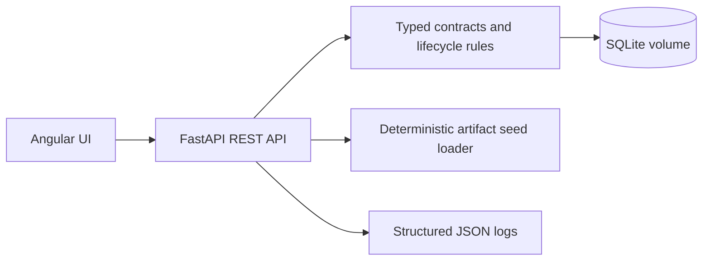

# Architecture

## Scope

The platform is a compact MLOps control room for registering model versions, enforcing approval, simulating deployments, recording events, comparing versions, and viewing monitoring data.

The implementation remains under `src/backend` and `src/frontend`. This `docs/` directory provides the submission-facing documentation structure.

## Components

## Data flow

1. Angular calls the typed FastAPI endpoints.
2. The API validates request data and lifecycle transitions.
3. SQLite persists models, versions, deployments, events, and metrics.
4. The seed loader imports the supplied artifacts for repeatable demos.
5. Docker Compose starts the backend and frontend with a health check.

## Deliberate boundaries

Deployment is synchronous and simulated. Authentication, external model serving, queues, Kubernetes, cloud storage, and PostgreSQL are future production extensions, not hidden dependencies.

See [`architecture-diagram.svg`](architecture-diagram.svg) for a standalone diagram artifact.
