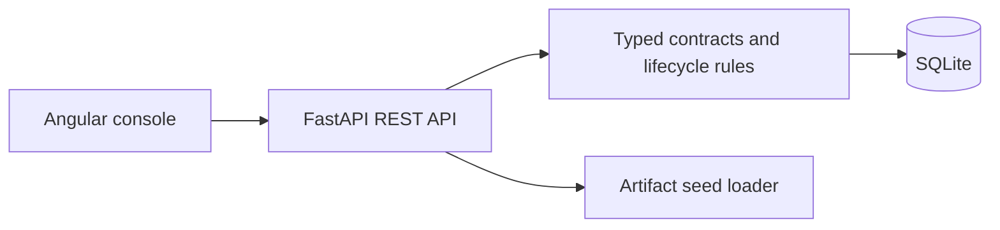

# Architecture

## Context and Scope
This G13 submission provides a small operational model registry: register models and versions, enforce lifecycle approval, request deterministic simulated deployments, inspect events, retry failures, roll back production, and read monitoring data.

## Overview

The API is the sole owner of state transitions. SQLite is file-backed and mounted as a Docker volume. A real deployment worker/model runtime is intentionally outside this time-boxed assignment.

## Domain Model
`models` own `versions`; versions carry artifact metadata, approval, and lifecycle stage. `deployments` reference a version and append immutable `events`. `metrics` are time-series snapshots keyed by model, version, and environment.

Lifecycle transitions are explicit: `DRAFT -> VALIDATED -> APPROVED -> STAGING -> PRODUCTION`, with controlled archive paths. Production deployment requires an approved/staging/production version. Deployment idempotency uses the unique `X-Idempotency-Key`.

## Reliability and Observability
Health is exposed at `/health`; deployment event history preserves failure, retry, and rollback evidence. Structured domain errors use `{detail: {code, message}}`. Docker health checks gate frontend startup.

## Trade-offs and Security
SQLite and synchronous simulated deployment minimize operational dependencies. There is no authentication, authorization, external model serving, queue, or cloud storage by design; these are documented extension points rather than hidden behavior. No secrets are committed.
